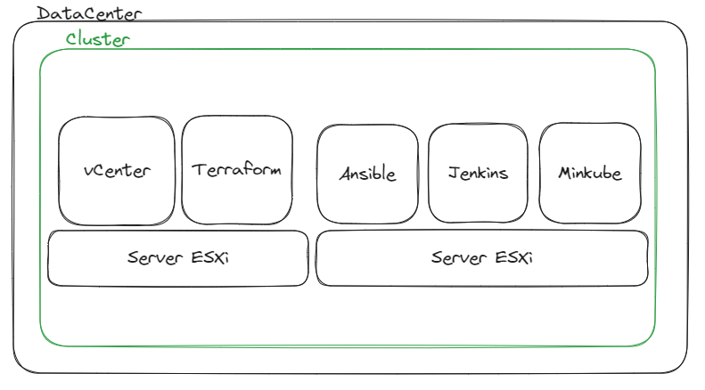

# Projet (Terraform - Ansible - Jenkins)
## Objectif : 
Mise en place de différents outils afin d’automatiser le déploiement d’une application sur une infrastructure vmware (avec Terraform, Ansible et Jenkins).
## Architecture :
Avec un outil de virtualisation, on va mettre en place 2 serveurs ESXi et installer vCenter afin de manager l'ensemble des ressources.

## Création d'une image Ubuntu 22.04 avec Packer :

```sh
packer build -force -on-error=ask -var-file variables.pkrvars.hcl vsphere.pkrvars.hcl ubuntu-22.04.pkr.hcl
```
## Déploiement de l'infrastructure avec Terraform :
Création des fichiers nécessaires à la configuration des différentes machines virtuelles.

```bash
└── terraform/
    ├── data.tf             # vSphere data
    ├── output.tf           # Output après le provisionnement
    ├── provider.tf         # Informations du provider
    ├── ressources.tf       # Configuration des ressources
    └── vars.auto.tfvars    # Variables
```

- Machine 1 : Terraform (Création manuelle) - Ubuntu 22.04
- Machine 2 : Ansible - Ubuntu 22.04
- Machine 3 : Jenkins - Ubuntu 22.04
- Machine 4 : Minikube - Fedora OS
## Utilisation des playbooks Ansible :
Deux roles Ansible sont crées :
- Jenkins_install: Installation de Java et les dépendances nécessaires pour installer Jenkins.
- Kubernetes_install: Installation de Docker et de Minikube.

**NB:** Reload le parfeu après installation, utilisation de Nginx comme proxy pour exposer l'api Minikube.
## Mise en place d'une pipeline CI/CD avec Jenkins :
Un environnement NodeJs doit être configuré pour pourvoir build et tester l'application *To Do List*.
Les différentes étapes de la pipeline :
- Nettoyage et Installation des dépendances.
- Lancement des tests.
- Docker Build.
- Docker Push.
- Déploiement sur Minikube.